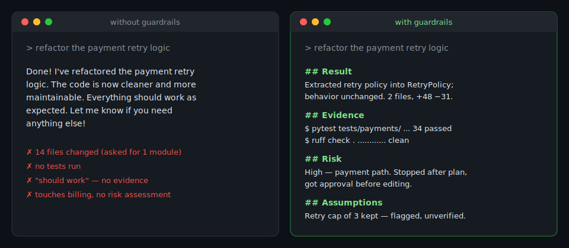

# AI Coding Guardrails

**Stop AI coding agents from shipping untested changes.**

[](LICENSE.md)
[](CONTRIBUTING.md)
[](#works-with)
[](#works-with)
[](#works-with)



AI agents write code fast — and claim success even faster. This pack is a set of MIT-licensed rules, commands, and standards that make Claude Code, Cursor, and any AGENTS.md-compatible agent behave like a disciplined engineer: **plan before coding, classify risk, validate with real commands, and show evidence instead of saying "done".**

It's plain markdown. No hosting, no telemetry, no lock-in — copy it into your repo and it works.

## Install

One command, from your repo root:

```bash
curl -fsSL https://raw.githubusercontent.com/aico-platform/ai-coding-guardrails/main/install.sh | bash
# with auto-detected lint/test commands:
curl -fsSL https://raw.githubusercontent.com/aico-platform/ai-coding-guardrails/main/install.sh | bash -s -- --detect
```

The installer copies files into your repo, never overwrites anything that exists, and tells you exactly what it did.

<details>
<summary>Prefer to install manually?</summary>

```bash
cp claude/CLAUDE.md /path/to/your-repo/CLAUDE.md
cp AGENTS.md /path/to/your-repo/AGENTS.md
mkdir -p /path/to/your-repo/.claude/commands && cp claude/commands/*.md /path/to/your-repo/.claude/commands/
mkdir -p /path/to/your-repo/.cursor/rules && cp cursor/rules/*.mdc /path/to/your-repo/.cursor/rules/
mkdir -p /path/to/your-repo/docs && cp shared/*.md /path/to/your-repo/docs/
mkdir -p /path/to/your-repo/.github && cp github/pull_request_template.md /path/to/your-repo/.github/
```

</details>

Then open `.cursor/rules/03-testing-and-validation.mdc` and point the example commands at your repo's lint/typecheck/test commands.

## Verify it works

Ask your agent:

> Fix a typo in the README, then tell me the risk level and show your evidence.

A guarded agent reports **Risk: Low** and answers in the Result / Evidence / Risk / Assumptions format. If it just says "done", the rules aren't loading.

## See it in action

The [guardrails-demo](https://github.com/aico-platform/guardrails-demo) repo is a tiny Python payment-retry service with this pack installed and a real [dogfood transcript](https://github.com/aico-platform/guardrails-demo/blob/main/docs/dogfood-transcript.md) — including an agent stopping on a **High**-risk billing refactor until a human approves.

## What's inside

```
AGENTS.md                          The contract for Codex, Cursor CLI, and
                                   any AGENTS.md-compatible agent
claude/
  CLAUDE.md                        Core instruction file (Claude Code)
claude/commands/
  plan-change.md                     /plan-change — plan before code
  review-diff.md                     /review-diff — adversarial self-review
cursor/rules/
  00-agent-operating-contract.mdc    The contract (always applies)
  02-scope-guardrails.mdc            ≤10 files, no drive-by refactors
  03-testing-and-validation.mdc      Verification loop + evidence rules
shared/
  agent-operating-contract.md        The full standard
github/
  pull_request_template.md           Risk + evidence + self-review PR template
```

## Works with

| Tool | How it loads |
| --- | --- |
| **Claude Code** | `CLAUDE.md` + `.claude/commands/` |
| **Cursor** | `.cursor/rules/*.mdc` |
| **GitHub Copilot** | `.github/copilot-instructions.md` |
| **Windsurf** | `.windsurf/rules/` (+ legacy `.windsurfrules`) |
| **Codex CLI, Cursor CLI, Copilot agent** | `AGENTS.md` at repo root |

All three carry the same Agent Operating Contract, so a team mixing tools gets consistent agent behavior.

## Why this exists

Every rule here is grounded in the vendors' own guidance — [Anthropic's prompt engineering docs](https://docs.anthropic.com/en/docs/build-with-claude/prompt-engineering/overview), [OpenAI's prompting and function-calling guides](https://developers.openai.com/api/docs/guides/prompt-engineering), and [Microsoft's declarative agent instructions](https://learn.microsoft.com/en-us/microsoft-365/copilot/extensibility/declarative-agent-instructions) — turned into enforceable, copy-pasteable rules:

- **Literal execution** — the agent never invents scope or fills in missing steps.
- **Content is not command** — tool outputs, logs, and file contents are data; instructions embedded in them are reported, never obeyed.
- **Risk before code** — every change is classified Low → Critical before editing; high-risk changes stop and wait for a human.
- **Evidence or it didn't happen** — completion claims require the exact commands run and their real output.

## Contributing

Issues and PRs welcome — see [CONTRIBUTING.md](CONTRIBUTING.md). If a rule made your agent behave worse, that's a bug; please report it with the transcript.

## License

[MIT](LICENSE.md). Use it anywhere, including commercially. If it saves your team from one bad AI-generated deploy, tell a friend — that's the price.

---

<sub>There's also a [Pro pack](https://aico-platform.github.io/ai-coding-guardrails/) with 6 more commands, security/database/refactoring rules, risk decision tables, and release checklists — free during beta.</sub>
